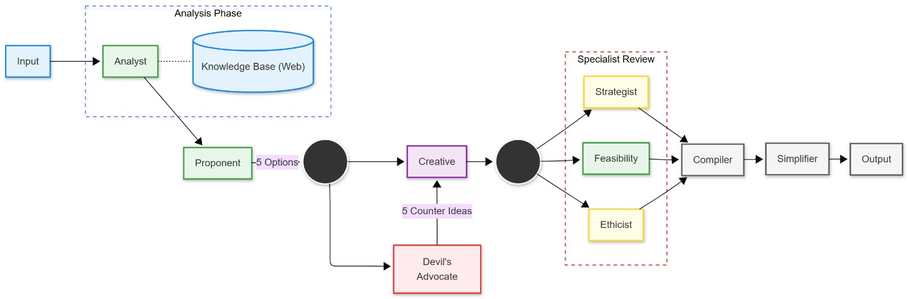

# 🧠 Multi-Agent Business Ideation System




> Simulates a corporate boardroom with specialized AI collaborators.
> This project converts a business prompt into a researched, critiqued, and validated strategy.

---

## 📌 Project Summary

This repository contains a final project notebook for a **refined multi-agent ideation system**. It uses a chain of AI agents to:

- analyze business concepts,
- debate strengths and weaknesses,
- synthesize improved recommendations,
- validate plans across strategy, ethics, and feasibility,
- and export a professional executive summary.

The core notebook is:

- `Final_Refined_Multi_Agent_System.ipynb`

Additional reference notebook:

- `Improved_Evaluation_Ideation_Multi_agent.ipynb`

---

## 🧩 How It Works

The system is built as a sequential multi-agent workflow. Each agent refines the output of the previous stage, creating a collaborative reasoning process.

1. **Research / Analyst**
   - Collects context, market history, and key facts.
2. **Ideation / Proponent**
   - Generates multiple business approaches and opportunities.
3. **Adversarial Review / Devil's Advocate**
   - Challenges assumptions, identifies risks, and exposes weaknesses.
4. **Synthesis / Creative Integrator**
   - Combines useful ideas and responses into an improved plan.
5. **Specialist Review**
   - Validates the concept from the perspectives of strategy, ethics, and feasibility.
6. **Reporting / Executive Editor**
   - Produces a polished markdown report and saves runtime logs.

---

## ✨ Key Features

- **Multi-Agent Collaboration:** Uses specialized agents instead of a single monolithic prompt.
- **Adversarial prompt engineering:** Forces the system to improve ideas through critique.
- **Chained context:** Later agents reuse and refine earlier outputs for consistency.
- **Structured logging:** Produces markdown summaries plus text/CSV debate transcripts.
- **Drive-powered persistence:** Saves outputs to Google Drive when executing in Colab.
- **Gradio interface support:** Provides a simple user-friendly front end for fast experimentation.

---

## 🛠 Prerequisites

Required before running the notebook:

- Python 3.10+
- A valid LLM API key for the chosen provider
  - Openrouter, Anthropic, Azure, or equivalent
- Internet access for model calls and optional web search

---

## 🚀 Installation and Execution

### Option 1: Run in Google Colab

1. Upload `Final_Refined_Multi_Agent_System.ipynb` to your Google Drive.
2. Open the notebook in Google Colab.
3. Run the setup cell to install dependencies:

```bash
!pip install crewai langchain_openai gradio duckduckgo-search
```

4. Mount your Drive if prompted:

```python
from google.colab import drive
drive.mount('/content/drive')
```

5. Enter your API key and execute the notebook cells in order.

### Option 2: Run locally

1. Create a virtual environment:

```bash
python -m venv venv
venv\Scripts\activate
```

2. Install dependencies:

```bash
pip install crewai langchain_openai gradio duckduckgo-search
```

3. Open the notebook with Jupyter Lab / Notebook and follow the execution steps.

---

## 📁 Expected Outputs

When the notebook completes, it generates:

- `Report_[Date]_[Topic].md` — Final executive summary
- `log_output_[Date].txt` — Full agent discussion transcript
- `log_output_[Date].csv` — Structured debug data

These outputs help evaluate both the final recommendation and the underlying reasoning process.

---

## 🔧 Customization

You can adjust the notebook to suit your goals:

- `temperature`: higher for creativity, lower for precision
- `model`: swap the underlying LLM provider or model name
- `agent roles`: refine prompts and specialty instructions
- `output format`: customize markdown or export to additional formats

---

## 📚 Notes

- This project is designed for ideation and exploratory strategy generation, not production financial advice.
- The multi-agent setup encourages robust critique and iteration before finalizing an idea.

---

## 📬 Contact

For questions or improvements, open an issue in the repository or update the notebook prompts directly.
